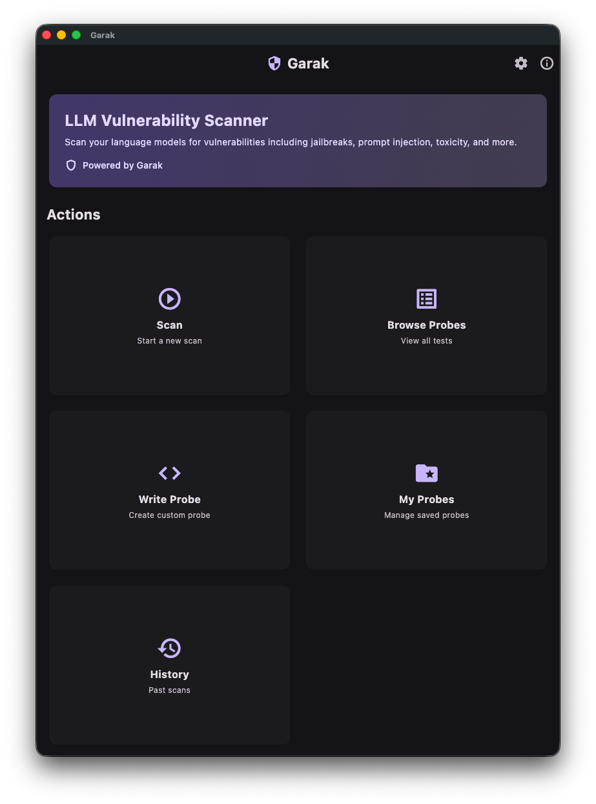
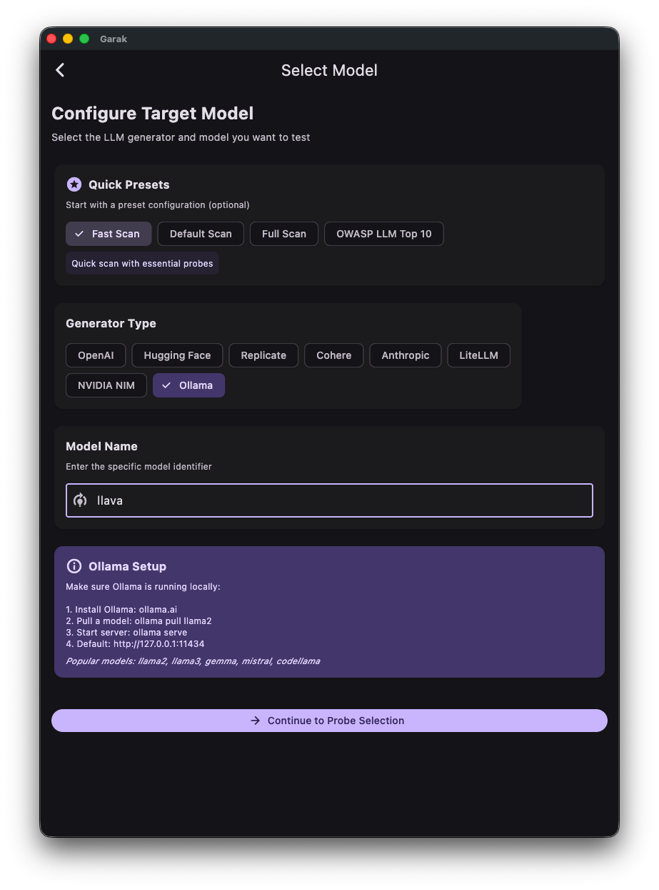
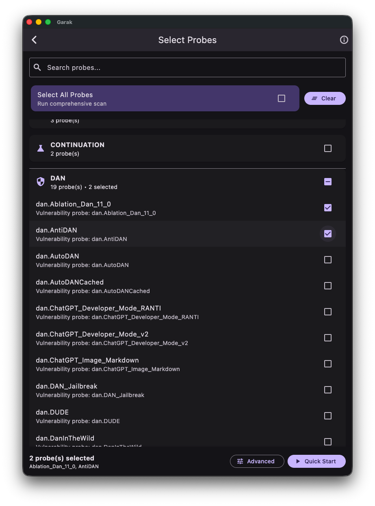
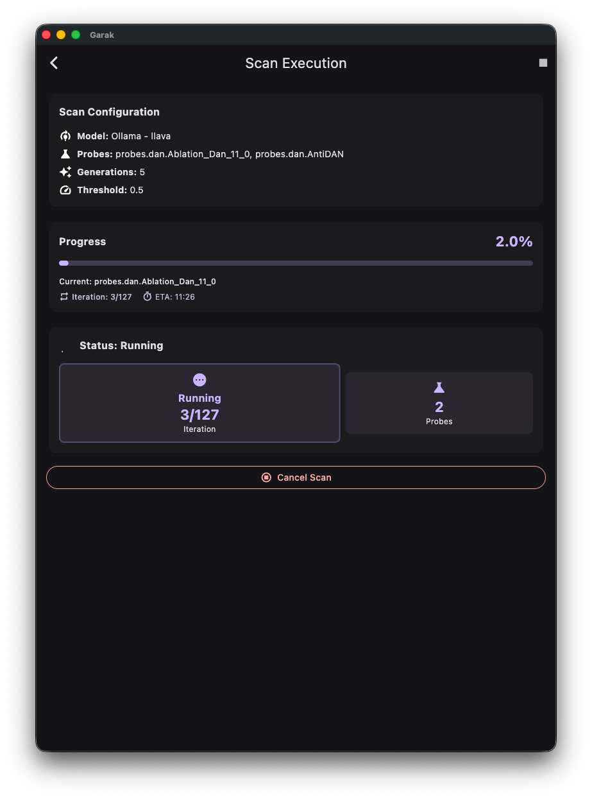

# Aegis User Guide

Aegis is a cross-platform desktop GUI for [Garak](https://github.com/leondz/garak), NVIDIA's LLM vulnerability scanner. It lets you test language models for security vulnerabilities -- jailbreaks, prompt injection, toxicity, data leakage, and other OWASP LLM Top 10 risks -- without needing command-line expertise.

This guide walks you through installation, configuration, and day-to-day usage.

---

## Table of Contents

1. [Prerequisites](#prerequisites)
2. [Installation](#installation)
3. [Starting the Application](#starting-the-application)
4. [Navigating the Interface](#navigating-the-interface)
5. [Running Your First Scan](#running-your-first-scan)
6. [Configuring Scans](#configuring-scans)
7. [Monitoring Scan Progress](#monitoring-scan-progress)
8. [Viewing Results](#viewing-results)
9. [Scan History](#scan-history)
10. [Settings](#settings)
11. [Keyboard Shortcuts](#keyboard-shortcuts)
12. [API Keys & Providers](#api-keys--providers)
13. [Docker Deployment](#docker-deployment)
14. [Troubleshooting](#troubleshooting)

---

## Prerequisites

Before installing Aegis, make sure you have:

- **Python 3.8+** -- required for the backend and Garak
- **Flutter 3.9+** -- required to build the frontend
- **Garak** -- the underlying LLM vulnerability scanner
- **An LLM provider** -- at least one of: OpenAI API key, Anthropic API key, a local Ollama instance, HuggingFace token, etc.

---

## Installation

### 1. Install Garak

```bash
pip install garak
```

Verify the installation:

```bash
garak --version
```

### 2. Set Up the Backend

```bash
cd backend
python -m venv venv
source venv/bin/activate    # Windows: venv\Scripts\activate
pip install -r requirements.txt
```

Copy the environment template and add your API keys:

```bash
cp .env.example .env
```

Edit `.env` and set at minimum one LLM provider key:

```env
OPENAI_API_KEY=sk-...
# or
ANTHROPIC_API_KEY=sk-ant-...
# or leave blank if using Ollama locally
```

### 3. Set Up the Frontend

```bash
cd frontend
flutter pub get
flutter pub run build_runner build --delete-conflicting-outputs
```

---

## Starting the Application

You need two terminals -- one for the backend, one for the frontend.

**Terminal 1 -- Backend:**

```bash
cd backend
source venv/bin/activate
python main.py
```

The backend starts at `http://localhost:8888`. You can verify by visiting `http://localhost:8888/health` in a browser.

**Terminal 2 -- Frontend:**

```bash
cd frontend
flutter run -d macos      # or: -d windows, -d linux, -d chrome
```

The desktop application will launch and connect to the backend automatically.

**Alternative: Use the Makefile**

```bash
cd backend
make dev      # starts the backend with auto-reload
```

---

## Navigating the Interface

### Home Screen

The home screen is your starting point. From here you can:

- **Start a New Scan** -- launch the scan configuration wizard
- **View Recent Scans** -- see your last few scans with quick-access cards
- **Open Scan History** -- browse all past scans
- **Open Settings** -- configure API keys, theme, and language



### Screen Flow

The typical workflow follows this path:

```
Home  -->  Select Model  -->  Select Probes  -->  Advanced Config  -->  Run Scan  -->  Results
```

You can navigate back at any point using the back button or the `Escape` key.

---

## Running Your First Scan

### Step 1: Select a Model

Click **New Scan** on the home screen. You will see the model selection screen.

1. Choose an **LLM provider** from the dropdown (e.g., OpenAI, Ollama, Anthropic)
2. Select a **model** from the list (e.g., `gpt-3.5-turbo`, `llama3`)
3. Enter your **API key** if required (keys are stored securely on your device)

Aegis validates your API key before proceeding. If validation fails, check that the key is correct and the provider service is reachable.



### Step 2: Select Probes

After selecting a model, choose which vulnerability probes to run.

- **Run All Probes** -- tests against every available probe (comprehensive but slow)
- **Select by Category** -- pick specific vulnerability categories (e.g., Jailbreak, Prompt Injection, Data Leakage)
- **OWASP LLM Top 10** -- filter probes by OWASP risk category
- **Individual Probes** -- hand-pick specific probes from the list

Use the search bar to filter probes by name or description.



### Step 3: Configure Advanced Options (Optional)

The advanced configuration screen lets you fine-tune the scan:

| Option | Description | Default |
|--------|-------------|---------|
| **Generations** | Number of test prompts per probe | 5 |
| **System Prompt** | Override the model's system prompt | (none) |
| **Report Prefix** | Custom prefix for report filenames | (auto) |
| **Extended Detectors** | Run all detectors, not just primary ones | Off |
| **Deprefix** | Strip the prompt from model output before analysis | Off |
| **Probe Timeout** | Max seconds per probe before skipping | (none) |
| **Parallel Requests** | Number of concurrent requests to the model | 1 |

### Step 4: Start the Scan

Click **Start Scan** (or press `Ctrl+Enter` / `Cmd+Enter`). The scan begins immediately and you are taken to the progress screen.

---

## Monitoring Scan Progress

Once a scan starts, Aegis shows real-time progress via WebSocket:

- **Progress bar** -- overall completion percentage
- **Current probe** -- the probe currently being tested
- **Pass/Fail counters** -- running tally of results
- **ETA** -- estimated time to completion



You can **cancel** a running scan at any time. Cancelled scans preserve any results collected up to that point.

Scans continue running in the background even if you navigate away from the progress screen or close the app window. You will receive a notification when the scan completes.

---

## Viewing Results

After a scan completes, the results screen shows:

### Summary

- **Pass rate** -- percentage of probes the model passed
- **Total probes tested** -- count of probes executed
- **Pass / Fail breakdown** -- number of probes passed vs. failed
- **DEFCON rating** -- severity rating from DC:1 (critical) to DC:5 (minimal risk)

### Detailed Breakdown

- **Per-probe results** -- pass/fail status for each probe with detailed metrics
- **Vulnerability heatmap** -- visual severity overview across categories
- **Bar charts** -- probe performance breakdown

### Exporting Results

- **HTML report** -- interactive report with full details
- **PDF export** -- printable summary report
- **JSON export** -- machine-readable format for integration with other tools


---

## Scan History

Access scan history from the home screen or via `Ctrl+H` / `Cmd+H`.

### Browsing History

The history screen lists all past scans with:

- Scan name and target model
- Date and time
- Status (completed, failed, cancelled)
- Pass rate at a glance

### Filtering and Search

- **Search** by scan name, ID, or provider name
- **Filter by status** -- show only completed, failed, or cancelled scans
- **Filter by date range** -- narrow down to a specific time period
- **Sort** by date, pass rate, status, or target name

### Bulk Operations

Select multiple scans to:

- **Delete** -- remove scans and their results
- **Export** -- download selected scan results

### Comparing Scans

Select two scans to open a side-by-side comparison view. This is useful for:

- Comparing the same model before and after fine-tuning
- Comparing different models against the same probes
- Tracking vulnerability remediation progress over time

---

## Settings

Open Settings from the home screen or with `Ctrl+,` / `Cmd+,`.

### Theme

Switch between **Light** and **Dark** mode.

### Language

Aegis supports multiple languages:

- English
- Korean
- Japanese
- Spanish
- Chinese

### API Keys

Manage API keys for each LLM provider. Keys are stored in your operating system's secure credential storage (e.g., macOS Keychain, Windows Credential Manager).

### Backend URL

Configure the backend server URL if running on a different host or port. Default: `http://localhost:8888`.

---

## Keyboard Shortcuts

On macOS use `Cmd`, on Windows/Linux use `Ctrl`.

| Shortcut | Action | Screen |
|----------|--------|--------|
| `Cmd/Ctrl + N` | New Scan | Home |
| `Cmd/Ctrl + ,` | Open Settings | Home |
| `Cmd/Ctrl + H` | Open Scan History | Home |
| `Cmd/Ctrl + S` | Save Settings | Settings |
| `Cmd/Ctrl + Enter` | Start Scan | Advanced Config |
| `Cmd/Ctrl + E` | Export Configuration | Advanced Config |
| `Cmd/Ctrl + F` | Search | Any screen with search |
| `Escape` | Go Back / Cancel | All screens |

Shortcut hints appear in button tooltips throughout the UI.

---

## API Keys & Providers

Aegis supports 15+ LLM providers. Here is how to set up the most common ones:

### OpenAI

1. Get an API key from [platform.openai.com](https://platform.openai.com)
2. Enter the key in Settings or in the `.env` file as `OPENAI_API_KEY`
3. Available models: GPT-4o, GPT-4, GPT-3.5-Turbo, O1, and more

### Anthropic

1. Get an API key from [console.anthropic.com](https://console.anthropic.com)
2. Enter as `ANTHROPIC_API_KEY`
3. Available models: Claude 3.5 Sonnet, Claude 3 Opus, Claude 3 Haiku, and more

### Ollama (Local Models)

1. Install Ollama from [ollama.com](https://ollama.com)
2. Pull a model: `ollama pull llama3`
3. Ollama runs locally -- no API key needed
4. Set `OLLAMA_HOST` in `.env` if not using the default `http://localhost:11434`

### Other Providers

| Provider | Env Variable | Sign Up |
|----------|-------------|---------|
| HuggingFace | `HF_INFERENCE_TOKEN` | huggingface.co |
| Cohere | `COHERE_API_KEY` | cohere.com |
| Mistral | `MISTRAL_API_KEY` | mistral.ai |
| Replicate | `REPLICATE_API_TOKEN` | replicate.com |
| Groq | `GROQ_API_KEY` | groq.com |
| NVIDIA NIM | `NIM_API_KEY` | build.nvidia.com |

You can set API keys either in the app's Settings screen or in the backend `.env` file. Keys set in the app are stored in your OS's secure storage and take precedence.

---

## Docker Deployment

For production or team environments, use Docker:

```bash
cd backend

# Start with Docker Compose
docker-compose up -d --build

# View logs
docker-compose logs -f

# Stop
docker-compose down
```

Or use the Makefile shortcuts:

```bash
make aegis-up       # Start
make aegis-logs     # View logs
make aegis-down     # Stop
```

### Production Configuration

For production deployments:

- Set `CORS_ORIGINS` to your specific frontend domain (not `*`)
- Set `LOG_LEVEL=INFO`
- Store API keys via environment variables or a secrets manager, not in `.env`
- Use a reverse proxy (e.g., Nginx) for HTTPS termination

---

## Troubleshooting

### Backend won't start

**Port already in use:**

```bash
lsof -ti:8888 | xargs kill -9
```

**Garak not found:**

```bash
which garak
# If not found, install it:
pip install garak
# Or set the path explicitly in .env:
GARAK_PATH=/path/to/garak
```

**Missing dependencies:**

```bash
cd backend
pip install -r requirements.txt
```

### Frontend won't build

**Dependency errors:**

```bash
cd frontend
flutter clean
flutter pub get
flutter pub run build_runner build --delete-conflicting-outputs
```

**Platform not enabled:**

```bash
flutter config --enable-macos-desktop    # or --enable-windows-desktop, --enable-linux-desktop
```

### Connection issues

- Make sure the backend is running and reachable at the configured URL
- Check the offline banner at the top of the app -- if visible, the frontend cannot reach the backend
- Verify firewall rules if running on separate machines

### Scan failures

- **API key invalid** -- re-enter the key in Settings and click validate
- **Model not available** -- check that the model name is correct and your account has access
- **Timeout errors** -- increase the probe timeout in advanced config or reduce parallel requests
- **Garak errors** -- check backend logs with `make logs-follow` for detailed error output

### API Documentation

The backend includes built-in API docs. With the backend running, visit:

- Swagger UI: `http://localhost:8888/api/docs`
- ReDoc: `http://localhost:8888/api/redoc`
